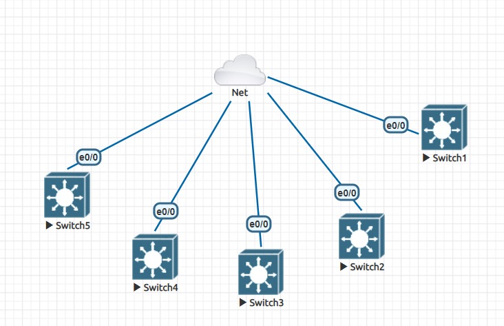

# Script cấu hình SSH các thiết bị có trong sơ đồ của EVE
## Yêu cầu:
* Cài đặt python 3.6 trở lên
* Cài đặt các thư viện cần thiết
  * Linux
  ```
  pip install -r requirement.txt
  ```
  * Windows
  ```
  py -m pip install -r requirement.txt
  ```
### Lưu ý: các cổng của thiết bị được nối vào internet để nhận DHCP là cổng interface e0/0


```bash
pmk@BlackDrag0n:~/network-script/Script config SSH on EVE-NG$ python3 config_ssh_Linux.py
Nhap IP server EVE-NG: 10.215.26.212
Nhap so luong thiet bi co trong so do mang: 5
Nhap password SSH ban muon dat cho cac thiet bi:
##########       IP Server EVE-NG: 10.215.26.212    ##########
1.Cau hinh SSH cho cac thiet bi 
2.Thu nhap cac IP cua thiet bi xuat ra file hosts 
0.Thoat 
##########      Username mac dinh: admin, Enable password mac dinh: 321 ##########
Nhap lua chon cua ban:
```
